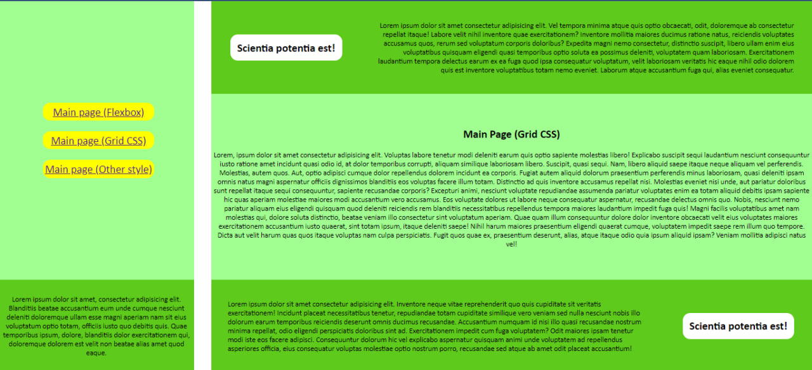
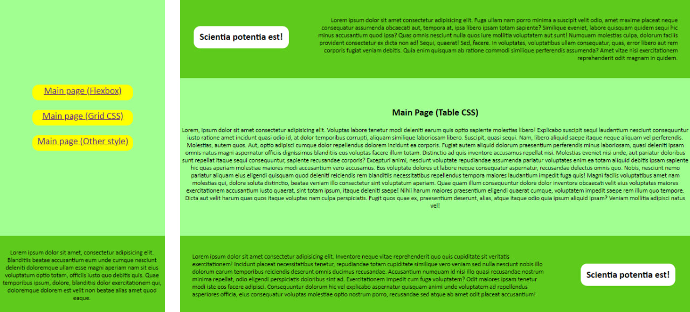

# Web-Lab-2

<b>Посилання на GitHub Pages:</b> https://nazaryimontytskyi.github.io/Web-Lab-2/

<b>1. Головна сторінка за допомогою Flexbox верстки</b>  

<b>2. Головна сторінка за допомогою GridCSS верстки</b>  

<b>3. Головна сторінка за допомогою використання таблиць (Tables)</b>  

  
<b>Примітки: </b>
Пропорції сторінок було збережено, проте через властивості версток Grid i CSS відбуваються незначні та дрібні зміщення двох головних вертикальних контейнерів.
Найбільш ефективним методом верстки видався FlexBox, проте Grid також є досить потужним засобом. Найбільш незручним та непрактичним методом верстки є використання таблиць, оскільки цей метод вже застарілий та зовсім не оновлюється.
